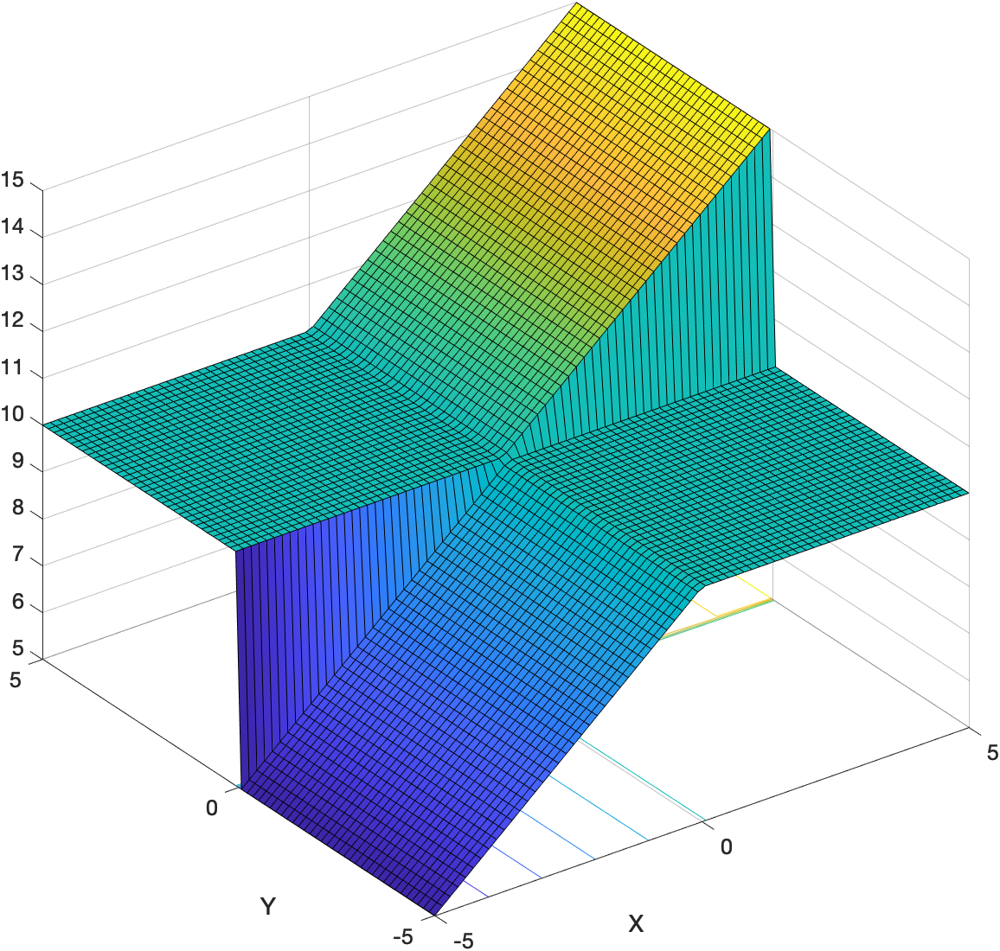

## Introduction

**FunctionOptimizer** - it is a matlab application for the optimization of functions with a help of 4 predefined algorithms such as Gradient Descent, Newton's Method( multidimensional ), Nelder Mead, and Simulated Annealing.

   
  

## Important information

Before starting to use this application, one should know certain properties of those algorithms. Why? Because without understanding them, the results might be unsatisfactory. 

**Gradient Descent** and **Newton's Method** are gradient-based algorithms, which means they can only be applied to smooth functions like:

  

But won't work for this one:

While **Nelder Mead** and **Simulated Annealing** are free from this limitation and therefore can be applied to all types of functions due to their heuristic nature. Another great thing about them is that they can escape from a local minimum, but at the same time it is a disadvantage because by escaping from the better situation they might end up in a worse one. Although it is not the case for **Gradient Descent** and **Newton's Method**, where every step is an improvement. 

## How to use it?

 

| Name | Description | Format |
| :---: | :---: | :---: |
| *objective function* | A function that needed to optimize | in matlab format |
| *x-axis range* | Range of values, between which a function will be plotted,  if empty then: **x-axis-range=y-axis-range** | two numbers( **start** and **end** ) separated by comma |
| *y-axis range* | Range of values, between which a function will be plotted,  if empty then: **y-axis-range=x-axis-range** | two numbers( **start** and **end** ) separated by comma |
| *amount points* | Controls smoothness of a graph. **For example:**   | a number( unsigned int ) |
| *x_0* | Initial position on x-axis from which optimization will be started | a number( double ) |
| *y_0* | Initial position on y-axis from which optimization will be started | a number( double ) |
| *Tolerance* | Reaching this value will stop the algorithm | a number( double ) |
| *MaxIter* | The maximum amount of iteration for the algorithm to perform before give up | a number( unsigned int ) |
| *StepSize* | This value controls the step size of the algorithm | a number( double ) |
| *Add Tab(button)* | Adds a new tab with separate axis and optimization settings. The maximum number of tabs is 4. | - |
| *Fast Plotting Mode(checkbox)* | This mode displays the results of optimization all at once. In each 'check' or 'uncheck' the graph of a function will be re-plotted. **For example:**   | - |
| *PLOT(button)* | Launch optimization process | - |
| *STOP(button)* (not visible) | Terminate optimization process | - |

## Known issues

Algorithms can go looking for a minimum outside of the plotted graph and it doesn't look good. There are two possible solutions:
- try to decrease 'StepSize' parameter or
- turn on 'fast plotting mode', since this mode plot the graph around the optimization results.

## Will work on

Matlab R2019a and above. 
And maybe on older versions too, but I didn't test it.

## License

Boost Software License( Version 1.0 )
